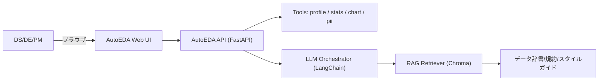
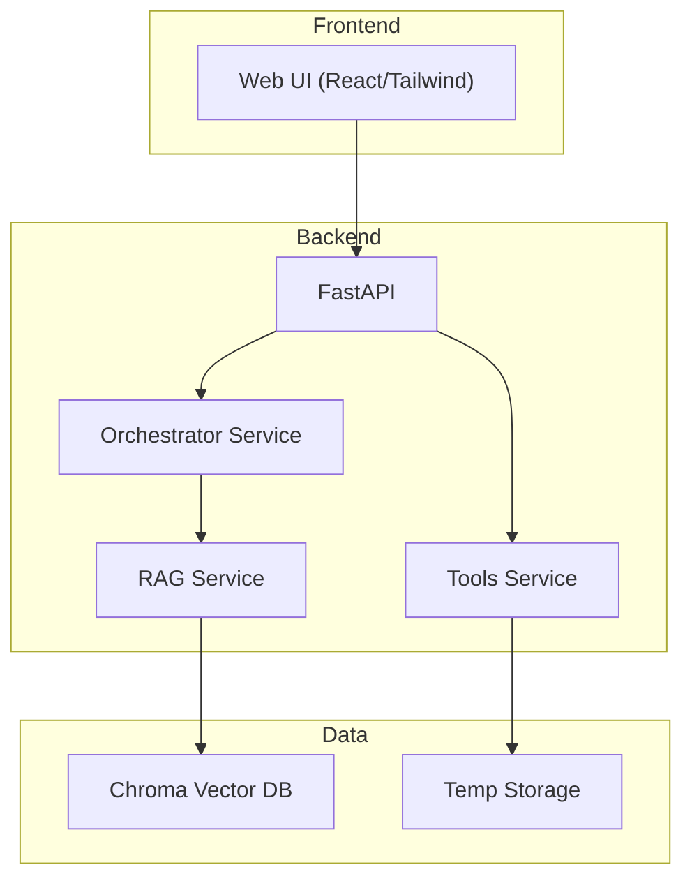
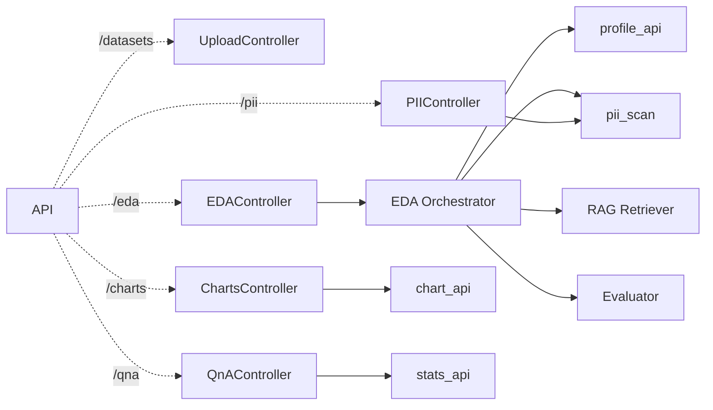
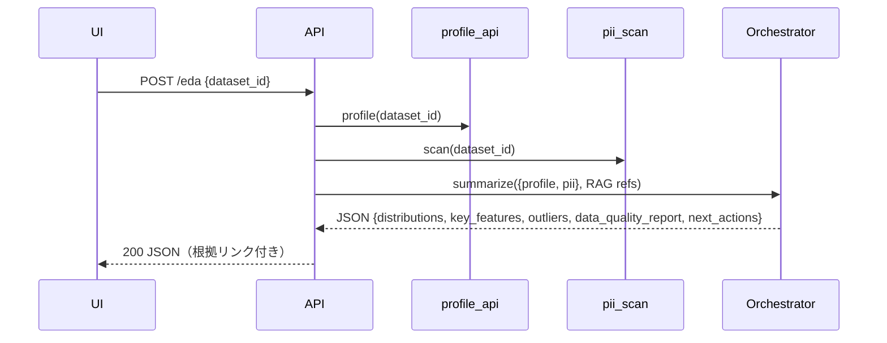
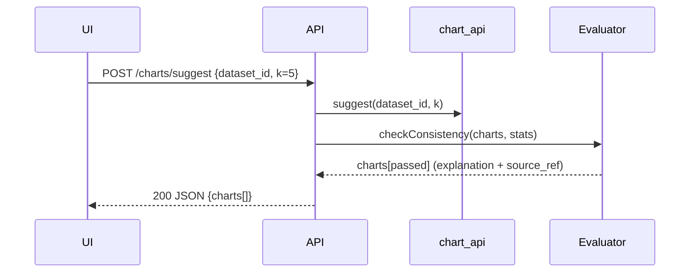
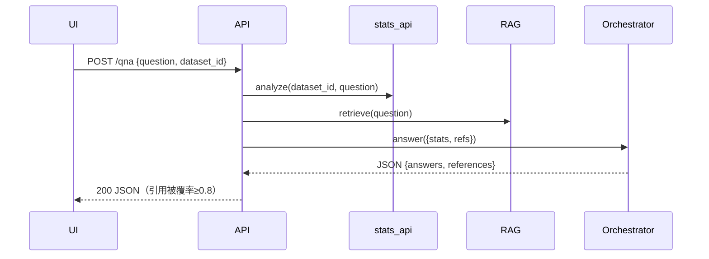
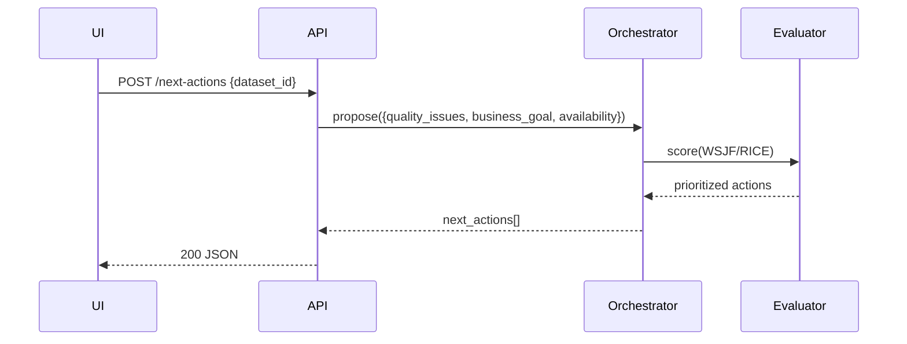
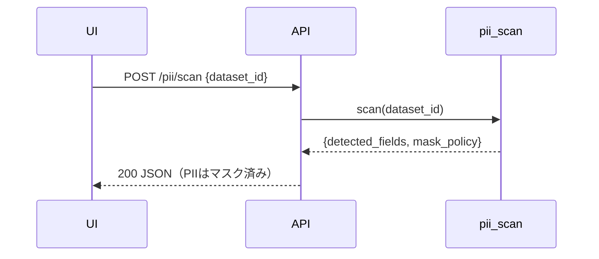
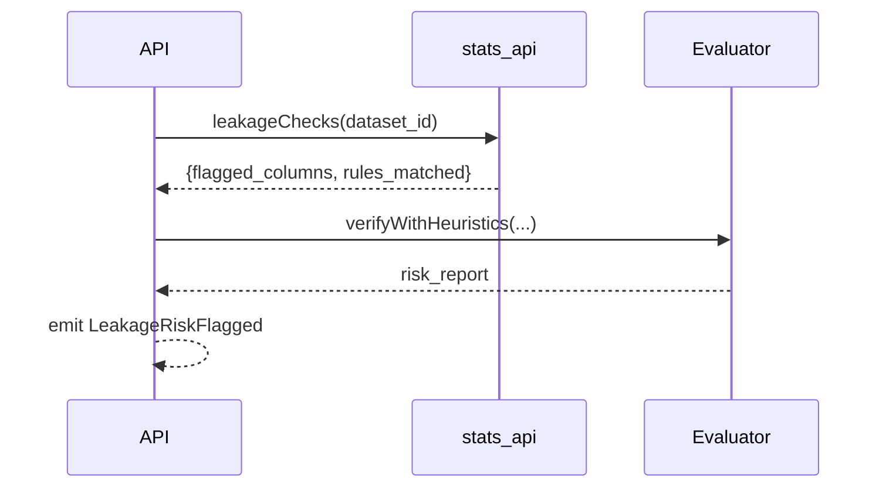
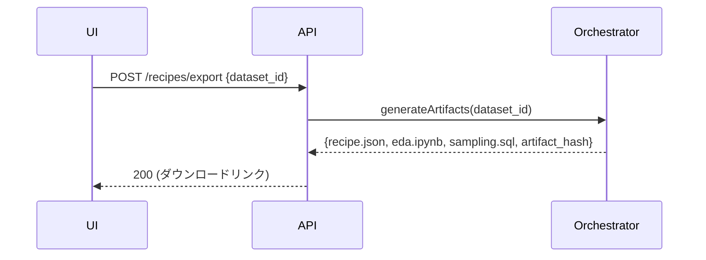

# 設計文書（High-Level Design）— AutoEDA（プロトタイピング版）

> 本設計は、`requirements.md` を**唯一の正典**として反映し、`02_sample_設計書` の体裁・粒度に**準拠**して記述しています。
> 対象は**ローカル実行のプロトタイピング**（Mac / Docker）＋**個人開発**。Web UI と API の両対応。
> LLM は **RAG/エージェント/関数呼び出し/構造化出力**を前提とし、**数値はツール出力のみ採用**（推測値禁止）。
> NFR: groundedness≥0.9、引用被覆率≥0.8、ストーリー別 p95 レイテンシ（A1≤10s, A2≤6s, B1≤4s, B2≤3s, C2≤5s, D1≤8s 等）、コスト上限（ストーリー別）を**必須条件**として明記。

---

## 概要

### 目的 / スコープ / 対象ユーザー

* **目的**: データの**アップロード/接続 → 品質診断 → 可視化提案 → Q\&A → 次アクション提案 → 再現レシピ出力**までを一気通貫で自動化し、EDA 工数を削減。
* **スコープ**: CSV 等の表形式データに対する EDA。RAG により**社内データ辞書/規約/スタイルガイド**を参照して根拠付き説明を生成。
* **対象ユーザー**: DS / DE / PM（飲食・小売・通信の案件横断）。

### 主要ユースケース（要約）

* **A1**: **即時プロファイリング**（CSV≤50列・≤100万行。`profile_api` + `pii_scan` → 構造化JSON）
* **A2**: **チャート自動提案**（`chart_api` 上位5件 + 説明文の**整合性検査**）
* **B1**: **根拠付きQ\&A**（`stats_api` + RAG、数値はツール出力のみ）
* **B2**: **次アクション提案**（`next_actions[]`：impact/effort/confidence/WSJF/RICE）
* **C1**: **PII 検出とマスキング**（列型推定＋辞書）
* **C2**: **リークリスク検査**（未来情報/集計後列/派生列のルール&軽量 LLM）
* **D1**: **再現レシピ出力**（`recipe.json`/`eda.ipynb`/`sampling.sql` 生成・ハッシュ付与）

### 成果物一覧

* **UI**: データアップロード・EDA レポート・チャート候補・Q\&A・次アクション・レシピ出力画面
* **サービス**: REST API（`profile_api`, `chart_api`, `stats_api`, `pii_scan`）、LLM オーケストレータ、評価器、RAG 検索
* **アーティファクト**: `distributions[]`, `key_features[]`, `outliers[]`, `data_quality_report`, `next_actions[]`, `recipe.json`, `eda.ipynb`, `sampling.sql`、監査/観測イベント

---

## アーキテクチャ

### 技術スタック（プロトタイピング優先）

* **フロントエンド**: React + Vite / Next.js（任意） + Tailwind CSS
* **バックエンド**: Python + FastAPI（Uvicorn/async）
* **LLM オーケストレーション**: LangChain（Agent + Tools + Structured Output）
* **Vector DB**: Chroma（データ辞書/規約/スタイルガイドの埋め込み格納）
* **可視化**: Matplotlib/Plotly（サーバサイド生成）＋ Vega-Lite JSON（クライアント描画も可）
* **データ処理**: pandas / numpy / scipy、PII 検出（正規表現＋辞書）
* **観測**: 構造化ログ（JSON）、簡易メトリクス（p95, tokens, groundedness）、OpenTelemetry（任意）
* **CI**: GitHub Actions（lint/test/build、Docker build）

### モノレポ構成（Nx/Turborepo想定、Apps/Packages/Services/Infra/Docs）

```
repo/
├─ apps/
│  ├─ web/                 # React UI（Vite/Next）
│  └─ api/                 # FastAPI（ASGI）
├─ packages/
│  ├─ ui-kit/              # 再利用 UI コンポーネント（Tailwind）
│  ├─ schemas/             # JSON Schema / Pydantic models / OpenAPI 共有
│  ├─ llm-prompts/         # System/Developer/User プロンプト群＋テンプレ
│  └─ client-sdk/          # TypeScript/Python SDK（API クライアント）
├─ services/
│  ├─ orchestrator/        # LLM Agent（LangChain）＋ Evaluator
│  ├─ tools/               # profile_api / stats_api / chart_api / pii_scan
│  └─ rag/                 # Embedding / Ingest / Retriever（Chroma）
├─ infra/
│  ├─ docker/              # dev 用 Dockerfile / compose
│  └─ ci/                  # GitHub Actions workflows
└─ docs/                   # ADR / HLD / API リファレンス
```

**境界規約**

* `apps/*` は `packages/*` と `services/*` の**公開 API**のみ参照（内部実装へ依存禁止）。
* 共有型/Schema は `packages/schemas` に一本化（UI/API 間の型乖離を防止）。
* `services/*` 相互は REST/関数境界（Port/Adapter）で依存し、**一方向依存**（UI→API→Services）。

### C4 — System（コンテキスト）



### C4 — Container



### C4 — Component（API/Agent/Tools の責務分割）



### データフロー / シーケンス（A1〜D1）

**A1 プロファイリング**



**A2 可視化提案**



**B1 Q\&A**



**B2 次アクション**



**C1 PII**



**C2 リーク検査**



**D1 レシピ出力**



---

## コンポーネントとインターフェース

### 主要コンポーネント（責務・入出力・拡張点）

| コンポーネント              | 主責務                 | 入力                       | 出力                         | エラー/フォールバック      | 拡張点         |
| -------------------- | ------------------- | ------------------------ | -------------------------- | ---------------- | ----------- |
| **UploadController** | CSV 受信/検証/保管        | multipart/form-data      | `dataset_id`               | 400（形式不正/サイズ超過）  | ストレージ差し替え   |
| **EDAController**    | A1 の統合実行            | `dataset_id`             | 構造化 JSON（根拠リンク付）           | 502（LLM失敗時は要再試行） | プロンプト/評価器差替 |
| **ChartsController** | A2 候補生成             | `dataset_id`, `k`        | `charts[]`（説明+source\_ref） | 整合性 NG→除外        | チャートライブラリ追加 |
| **QnAController**    | B1 回答生成             | `question`, `dataset_id` | 回答+引用                      | 引用不足→補完サイクル      | ドメイン拡張辞書    |
| **PIIController**    | C1 スキャン             | `dataset_id`             | 検出結果+ポリシ                   | 誤検知率閾値で警告        | ルール/辞書更新    |
| **Orchestrator**     | LLM 制御/RAG 連携       | Tool 結果/refs             | 構造化出力                      | JSON 不整合→再生成     | CoT/反証探索    |
| **Evaluator**        | groundedness/整合性/監査 | 応答/根拠/統計                 | スコア/弾きリスト                  | スコア閾値調整          | ルール/軽量 LLM  |

### API 契約（抜粋 / OpenAPI 風）

```yaml
# POST /api/datasets/upload
requestBody:
  content: { multipart/form-data: { schema: { type: object, properties: { file: { type: string, format: binary } }, required: [file] } } }
responses:
  "200": { content: { application/json: { schema: { type: object, properties: { dataset_id: { type: string } }, required: [dataset_id] } } } }
```

```yaml
# POST /api/eda
requestBody:
  content: { application/json: { schema: { type: object, properties: { dataset_id: { type: string } }, required: [dataset_id] } } }
responses:
  "200": { content: { application/json: { schema: { $ref: "#/components/schemas/EDAReport" } } } }
```

```yaml
# POST /api/charts/suggest
requestBody:
  content: { application/json: { schema: { type: object, properties: { dataset_id: { type: string }, k: { type: integer, default: 5 } }, required: [dataset_id] } } }
responses:
  "200": { content: { application/json: { schema: { type: object, properties: { charts: { type: array, items: { $ref: "#/components/schemas/ChartCandidate" } } }, required: [charts] } } } }
```

```yaml
# POST /api/qna
requestBody:
  content: { application/json: { schema: { type: object, properties: { dataset_id: { type: string }, question: { type: string } }, required: [dataset_id, question] } } }
responses:
  "200": { content: { application/json: { schema: { type: object, properties: { answers: { type: array, items: { $ref: "#/components/schemas/Answer" } }, references: { type: array, items: { $ref: "#/components/schemas/Reference" } } }, required: [answers, references] } } } }
```

```yaml
# POST /api/pii/scan
requestBody:
  content: { application/json: { schema: { type: object, properties: { dataset_id: { type: string } }, required: [dataset_id] } } }
responses:
  "200": { content: { application/json: { schema: { type: object, properties: { detected_fields: { type: array, items: { $ref: "#/components/schemas/PIIField" } }, mask_policy: { type: string } }, required: [detected_fields, mask_policy] } } } }
```

### 構造化出力のスキーマ（`schemas` パッケージで共有）

```json
{
  "$id": "EDAReport",
  "type": "object",
  "properties": {
    "distributions": {
      "type": "array",
      "items": { "$ref": "Distribution" }
    },
    "key_features": { "type": "array", "items": { "type": "string" } },
    "outliers": {
      "type": "array",
      "items": { "$ref": "OutlierInfo" }
    },
    "data_quality_report": { "$ref": "DataQualityReport" },
    "next_actions": {
      "type": "array",
      "items": { "$ref": "NextAction" }
    },
    "references": { "type": "array", "items": { "$ref": "Reference" } }
  },
  "required": ["distributions","key_features","outliers","data_quality_report","next_actions"]
}
```

```json
{ "$id": "Distribution", "type": "object",
  "properties": {
    "column": {"type":"string"},
    "dtype": {"type":"string"},
    "count": {"type":"integer"},
    "missing": {"type":"integer"},
    "histogram": {"type":"array","items":{"type":"number"}},
    "source_ref": {"$ref":"Reference"} } }
```

```json
{ "$id":"DataQualityReport","type":"object",
  "properties": { "issues": {
    "type":"array","items":{
      "type":"object",
      "properties":{
        "severity":{"type":"string","enum":["low","medium","high","critical"]},
        "column":{"type":"string"},
        "description":{"type":"string"},
        "statistic":{"type":"object"},
        "evidence":{"$ref":"Reference"} },
      "required":["severity","column","description","statistic"] } } } }
```

```json
{ "$id":"NextAction","type":"object",
  "properties":{
    "title":{"type":"string"},
    "reason":{"type":"string"},
    "impact":{"type":"number","minimum":0,"maximum":1},
    "effort":{"type":"number","minimum":0,"maximum":1},
    "confidence":{"type":"number","minimum":0,"maximum":1},
    "score":{"type":"number"},              /* WSJF/RICE 等 */
    "dependencies":{"type":"array","items":{"type":"string"}}
  },
  "required":["title","impact","effort","confidence"] }
```

```json
{ "$id":"ChartCandidate","type":"object",
  "properties":{
    "id":{"type":"string"},
    "type":{"type":"string"},
    "spec":{"type":"object"},               /* Vega-Lite 等 */
    "explanation":{"type":"string"},
    "source_ref":{"$ref":"Reference"},
    "consistency_score":{"type":"number"} },
  "required":["id","type","explanation","source_ref"] }
```

```json
{ "$id":"Reference","type":"object",
  "properties":{
    "kind":{"type":"string","enum":["table","column","cell","figure","query","doc"]},
    "locator":{"type":"string"},            /* 例: table:sales/col:amount */
    "evidence_id":{"type":"string"}         /* chart_id / query_id / doc_hash など */
  },
  "required":["kind","locator"] }
```

---

## データモデル

### メタデータ / 監査 / イベントスキーマ

```json
{
  "event_name": "EDAReportGenerated",
  "properties": {
    "user_id":"u_123",
    "dataset_id":"ds_123",
    "rows": 1000000,
    "cols": 48,
    "sample_ratio": 0.1,
    "model_id":"llm-x",
    "tokens_used": 12345,
    "duration_ms": 8400,
    "groundedness": 0.92
  },
  "pii_flag": true,
  "retention": "90d",
  "prompt_hash": "eda_v1_a1",
  "tool_calls": [
    {"name":"profile_api","success":true},
    {"name":"pii_scan","success":true}
  ]
}
```

**イベント一覧**（他）：`ChartsSuggested`, `EDAQueryAnswered`, `NextActionsProposed`, `PIIMasked`, `LeakageRiskFlagged`, `EDARecipeEmitted`, `FollowupAnswered`

### Vector DB インデックス（Chroma）

* **Collection**: `data_dictionary`, `style_guides`, `domain_rules`
* **Embedding**: text-embedding-3 など（ローカル代替可）
* **Metadata**: `doc_type`, `table`, `column`, `version`, `hash`
* **検索**: Top-k + 再ランク（回答生成時は**引用必須**）

### PII マスキングポリシ

* **検出**: 正規表現＋辞書照合（氏名/電話/メール等）。
* **マスク**: 表示/保存/送信ポリシ（`MASK`, `HASH(SALTED)`, `DROP`）。
* **ログ**: `PIIMasked` イベントに `detected_fields[]`, `mask_policy` を記録。

---

## エラーハンドリング & ガードレール

* **タイムアウト/再試行**: Tool（profile/stats/chart/pii）、LLM 呼び出しに個別タイムアウト・指数バックオフ。
* **フォールバック**: LLM 失敗時は**ツール結果のみの簡易要約**を返却（ラベル付き）。
* **ポリシーチェック**: 機密語リスト・出力サイズ上限・JSON スキーマ検証。
* **入力検証**: CSV 形式、列上限・行上限チェック、極端な異常値の警告。

---

## テスト戦略（TDD/BDD）

### ピラミッド

* **Unit**: pandas 集計、正規表現検出、Pydantic Schema、スコア計算（WSJF/RICE）。
* **Component**: 各 Controller + Service（FastAPI TestClient）。
* **Contract**: OpenAPI スキーマに対するリクエスト/レスポンス検証。
* **Integration**: A1/A2/B1/B2/C1/C2/D1 の結合テスト。
* **E2E**: UI からの主要フロー（アップロード→EDA→チャート→Q\&A→レシピ）。

### LLM 評価（自動）

* **指標**: groundedness≥0.9、**引用被覆率≥0.8**、整合性スコア、Hallucination 率@k。
* **ゴールデンテスト**: 代表データセットに対する期待 JSON をスナップショット管理。
* **プロンプト回帰**: プロンプト差分で評価劣化を検出（CI で失敗させる）。

### BDD（例: A1）

```gherkin
Feature: A1 即時プロファイリング
  Scenario: CSV をアップロードして構造化レポートを得る
    Given CSV "sales.csv" (<=50 列, <=1,000,000 行)
    When ユーザーが /api/eda に dataset_id を指定して POST する
    Then レスポンスは 200 で distributions/key_features/outliers/data_quality_report/next_actions を含む
      And 各セクションに根拠リンクが付与されている
      And p95 レイテンシは 10 秒以下である
```

---

## 非機能要件（NFR）

| Story  |      p95 レイテンシ |   コスト上限（LLM） | 品質指標                                           | その他                 |
| ------ | -------------: | -----------: | ---------------------------------------------- | ------------------- |
| **A1** | ≤10s（サンプリング許可） | ≤1.0円/1K tok | groundedness≥0.9、Hallucination\@5≤2%           | 応答最大 50KB、可用性≥99.9% |
| **A2** |            ≤6s | ≤0.6円/1K tok | 説明×統計の一致率≥0.95、引用必須                            | ストリーミング差分           |
| **B1** |            ≤4s | ≤0.5円/1K tok | 引用被覆率≥0.8、数値＝ツール出力のみ                           | 履歴圧縮                |
| **B2** |            ≤3s | ≤0.3円/1K tok | next\_actions に impact/effort/confidence/score | 優先度付け必須             |
| **C1** |             ≤— |            — | PII 再現率≥0.95、誤検知≤0.05                          | 監査イベント必須            |
| **C2** |            ≤5s |            — | 既知リーク検出率≥0.9、誤警告≤0.1                           | ルール & 軽量 LLM        |
| **D1** |            ≤8s | ≤0.8円/1K tok | A1 主要統計±1%で再現                                  | 依存リスト同梱             |

（セキュリティ/プライバシーは**初期は簡易**。ただし PII マスキング・監査ログ・最小限の出力フィルタは有効化）

---

## 実装詳細（SOLID / Port & Adapter）

* **パッケージ分割**: `schemas` に型/Schema、`client-sdk` に API SDK、`tools` は純粋関数群（I/O を分離）。
* **DIP**: Controller は `Service` の抽象に依存、実装は DI コンテナで注入。
* **Ports**: `RAGPort`, `LLMPort`, `ChartPort`、**Adapters**: ChromaAdapter, OpenAIAdapter, MatplotlibAdapter など。
* **キャッシュ**: Q\&A・RAG 結果を短期キャッシュ（メモリ/ファイル）。
* **ストリーミング**: A2 などで進捗/差分配信（サーバ sent events 任意）。
* **i18n/a11y**: ラベルとテーブル要約、キーボード操作対応。

---

## 観測性（Observability）

* **ログ**: JSON 構造化（level, event\_name, dataset\_id, prompt\_hash, duration\_ms, tokens）。
* **メトリクス**: p95/p99、成功率、再試行率、groundedness、引用被覆率。
* **トレース**: `/api/eda` → `profile_api` → `pii_scan` → `orchestrator` → `rag`（span/tag）。
* **ダッシュボード**: ストーリー別レイテンシ、失敗率、品質指標の月次推移。

---

## リスクと軽減策

| リスク              | 影響           | 低減策                                 |
| ---------------- | ------------ | ----------------------------------- |
| 大規模データのレイテンシ/メモリ | 応答遅延/失敗      | サンプリング・型推定の先行実行・列選択                 |
| LLM の過大一般化/幻覚    | 誤説明/信頼低下     | RAG 必須 + Evaluator の整合性/引用検査 + 反証探索 |
| PII 漏えい          | 法的/信用問題      | 事前スキャン/マスク/監査イベント、出力フィルタ            |
| リークリスク見逃し        | 学習の汚染/本番ドリフト | ルール + 既知パターン回帰テスト + 軽量 LLM 補助       |
| コスト増             | 運用継続困難       | 軽量モデル切替・再利用キャッシュ・早期停止               |

---

## 進行計画（MVP → GA）

1. **Week 1**: リポジトリ/CI/Docker 雛形、`schemas`/`client-sdk` 基盤
2. **Week 2**: `profile_api`/`pii_scan` 実装 + Unit/Contract test
3. **Week 3**: Orchestrator（LLM+RAG）/A1 完了、観測イベント出力
4. **Week 4**: `chart_api` + Evaluator（整合性検査）、A2 完了
5. **Week 5**: `stats_api` + B1/B2（優先度付け）
6. **Week 6**: C2 リーク検査、D1 レシピ生成、E1 高速応答
7. **Week 7**: 性能/品質チューニング、ドキュメント/ADR 整備（MVP）

**フィーチャートグル**: `feature.pii`, `feature.leakage`, `feature.recipes`, `feature.stream`

---

## 付録

### 主要設定例（GitHub Actions / FastAPI / Docker）

**.github/workflows/ci.yml**

```yaml
name: ci
on: [push, pull_request]
jobs:
  build-test:
    runs-on: ubuntu-latest
    steps:
      - uses: actions/checkout@v4
      - uses: actions/setup-python@v5
        with: { python-version: "3.11" }
      - run: pip install -r apps/api/requirements.txt
      - run: pytest -q
      - run: ruff check .
      - run: mypy apps/api
```

**apps/api/main.py（抜粋）**

```python
from fastapi import FastAPI
from routers import eda, charts, pii, qna
app = FastAPI(title="AutoEDA API")
app.include_router(eda.router, prefix="/api/eda", tags=["eda"])
app.include_router(charts.router, prefix="/api/charts", tags=["charts"])
app.include_router(pii.router, prefix="/api/pii", tags=["pii"])
app.include_router(qna.router, prefix="/api/qna", tags=["qna"])
```

**infra/docker/Dockerfile（dev 用）**

```dockerfile
FROM python:3.11-slim
WORKDIR /app
COPY apps/api/requirements.txt .
RUN pip install -r requirements.txt
COPY apps/api /app
CMD ["uvicorn","main:app","--host","0.0.0.0","--port","8000","--reload"]
```

### ADR（例）

* ADR-001: モノレポ採用（Apps/Packages/Services/Infra/Docs）
* ADR-002: LLM Orchestration に LangChain を採用
* ADR-003: RAG の VectorDB に Chroma を採用
* ADR-004: 構造化出力は JSON Schema を単一共有源（SSOT）化

### 用語集

* **EDA**: 探索的データ分析。
* **RAG**: 検索拡張生成。根拠文書を検索して LLM に渡し、回答の根拠を強化。
* **PII**: 個人を特定し得る情報。
* **Groundedness**: 応答が**根拠**（ツール/文書）に基づく度合い。
* **引用被覆率**: 応答内の主張が**引用**で裏づけられている割合。

---

### 参考：Story→コンポーネント対応（抜粋）

| Story  | 主責務                           | 主要 API/契約                     | 成功条件                                     |
| ------ | ----------------------------- | ----------------------------- | ---------------------------------------- |
| **A1** | Upload/Profiling Orchestrator | `POST /api/eda`（構造化 JSON）     | `data_quality_report.issues[]` に重大度/根拠必須 |
| **A2** | Chart Suggester + Evaluator   | `POST /api/charts/suggest`    | **説明と統計の一致率≥0.95**、source\_ref 必須        |
| **B1** | QnA Agent（RAG+stats\_api）     | `POST /api/qna`               | **引用被覆率≥0.8**、数値＝ツール出力のみ                 |
| **B2** | Action Prioritizer            | `POST /api/next-actions`（内部）  | impact/effort/confidence/score を付与       |
| **C1** | PII Scanner                   | `POST /api/pii/scan`          | 検出再現率≥0.95、監査イベント                        |
| **C2** | Leakage Checker               | `POST /api/leakage/check`（内部） | 検出率≥0.9、誤警告≤0.1                          |
| **D1** | Recipe Generator              | `POST /api/recipes/export`    | 再現±1%、ハッシュ/依存同梱                          |

> **備考（プロトタイプ方針）**
>
> * セキュリティは最小限（ローカル前提）。PII マスキング・出力フィルタ・監査ログのみ必須。
> * すべての**数値/統計**は `profile_api` / `stats_api` 等の**ツール出力のみ**を採用。
> * **引用/根拠リンク必須**（`Reference` スキーマで**図表ID/セル範囲/クエリID/ドキュメントID**を付与）。
> * 将来のクラウド運用（S3/Cloud Run 等）を見据えつつ、**当面はローカル/Docker**で完結。
