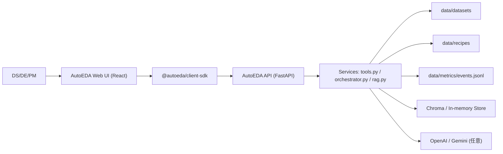
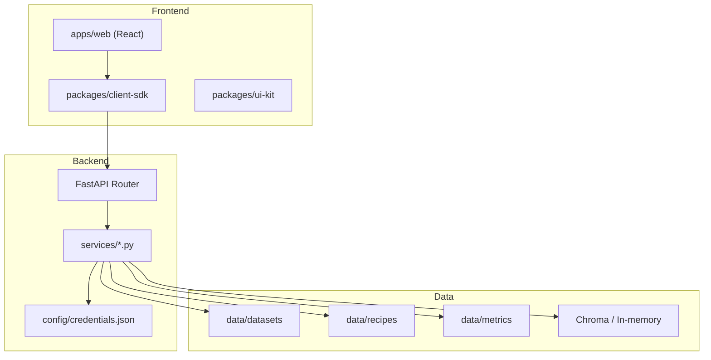
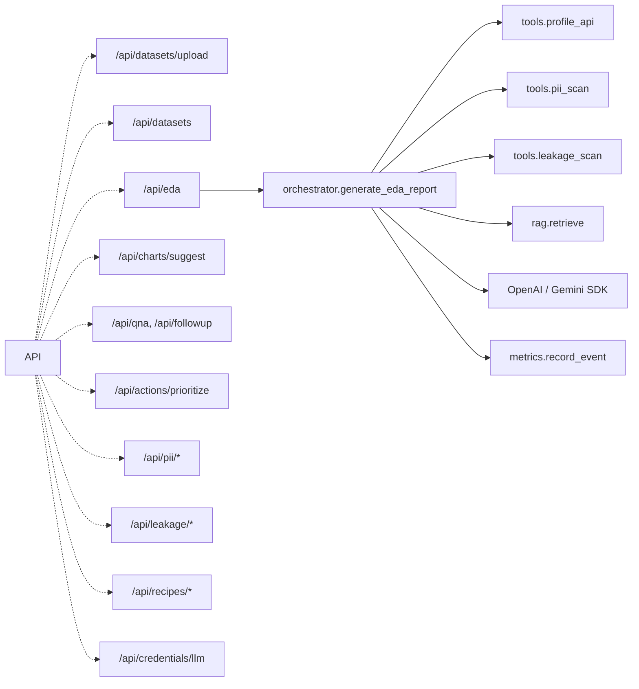

# 設計文書（High-Level Design）— AutoEDA（プロトタイプ v1）

本設計は `docs/requirements.md` を正典として反映し、現時点の実装 (`apps/api`, `apps/web`, `packages/*`) に基づく情報をまとめる。プロトタイプはローカル実行を前提とし、LLM が未設定の場合はすべてのストーリーでツール主導のフォールバックを行う。

---

## 1. 目的 / スコープ / ユーザー

- **目的**: CSV 等の表形式データをアップロードし、プロファイル生成 (A1) → チャート提案 (A2) → 根拠付き Q&A (B1) → 次アクション優先度付け (B2) → 品質/リーク検査 (C1/C2) → 再現レシピ生成 (D1) までを自動化する。
- **スコープ**: ローカル PC 上での FastAPI + React 実行、API/SDK/UI/テストの統合。インフラプロビジョニングや本番運用は範囲外。
- **ユーザー**: データサイエンティスト (DS)、データエンジニア (DE)、プロダクトマネージャー (PM)。

---

## 2. ハイレベルアーキテクチャ

### 2.1 技術スタック

| レイヤー | 採用技術 | 備考 |
| -------- | -------- | ---- |
| フロントエンド | React 18 + Vite + React Router | `/apps/web`。API 呼び出しは `packages/client-sdk` 経由。
| バックエンド | FastAPI + Pydantic + Uvicorn | `/apps/api/main.py` がエントリポイント。
| サービス層 | Python モジュール (`apps/api/services/*.py`) | プロファイル、PII、リーク、レシピ、RAG、メトリクスを分離。
| LLM 連携 | OpenAI / Google Gemini SDK (オプション) | `apps/api/services/orchestrator.py` が直接 SDK を呼び出す。LangChain は未使用。
| RAG | Chroma PersistentClient (任意) + OpenAI Embedding | 未設定時はインメモリ検索にフォールバック (`rag.py`)。
| メトリクス | 独自 JSON Lines (`data/metrics/events.jsonl`) | `metrics.py` が収集し、Python スクリプトで SLO を評価。
| スキーマ共有 | Zod | `packages/schemas` が API/フロント間で型を共有。

### 2.2 モジュール責務

| モジュール | 役割 | 主なファイル |
| ---------- | ---- | ------------ |
| API ルータ | REST エンドポイントの公開 | `apps/api/main.py` |
| プロファイリング | CSV 読み込み、欠損/外れ値計算、次アクション算出 | `apps/api/services/tools.py` (`profile_api`) |
| チャート提案 | 分布/時系列/カテゴリ/相関分析と候補生成 | `apps/api/services/tools.py` (`chart_api`) |
| Q&A | 質問応答テンプレート生成、追質問サポート | `apps/api/services/tools.py` (`stats_qna`, `followup`) |
| 優先度付け | WSJF / RICE 計算 | `apps/api/services/tools.py` (`prioritize_actions`) |
| PII / リーク | 正規表現 + pandas による簡易検査とメタ更新 | `apps/api/services/tools.py` (`pii_scan`, `apply_pii_policy`, `leakage_*`) |
| レシピ生成 | `recipe.json` / `eda.ipynb` / `sampling.sql` / ハッシュ算出 | `apps/api/services/tools.py` (`recipe_emit`), `recipes.py` |
| オーケストレーション | ツール結果の統合、LLM 呼び出し、フォールバック制御 | `apps/api/services/orchestrator.py` |
| RAG | ドキュメント ingest / retrieve, フォールバック検索 | `apps/api/services/rag.py` |
| メトリクス | イベント集約、SLO 判定補助 | `apps/api/services/metrics.py` |
| ストレージ | データセット/メタ保存 (`data/datasets`) | `apps/api/services/storage.py` |
| フロント SDK | Fetch + フォールバック、LLM 設定呼び出し | `packages/client-sdk/src/index.ts` |
| UI キット | 共通 UI 要素 (Button) | `packages/ui-kit/src/index.tsx` |

### 2.3 C4 図

**System Context**

**Container**

**Component (API サービス層)**

---

## 3. データフローとストーリー別詳細

### 3.1 A1: プロファイル生成 (`POST /api/eda`)

1. `tools.profile_api` が `data/datasets/<id>.csv` を pandas または CSV 直読みで解析。欠損・外れ値・次アクションを算出。
2. `tools.pii_scan` / `tools.leakage_scan` を安全に呼び、参照へ追加。
3. LLM 設定が存在すれば `orchestrator._invoke_llm_agent` が補足要約を生成。失敗時/未設定時は `tool:` 参照付きフォールバックを組み立て。
4. `metrics.record_event("EDAReportGenerated", …)` が所要時間と groundedness を記録。
5. 応答は `EDAReport` スキーマ（`packages/schemas`）で検証される。

### 3.2 A2: チャート提案 (`POST /api/charts/suggest`)

- `tools.chart_api` がプロファイル情報と 5,000 行プレビューを元に候補チャートを生成。
- `evaluator.consistency_ok` が `consistency_score >= 0.95`、トレンド整合性、相関の符号を検証。
- メトリクスとして候補数と処理時間を記録。

### 3.3 B1/B2: Q&A と次アクション

- `tools.stats_qna` がテンプレート回答を生成。LLM 未設定でもハルシネーションを防ぐため数値はツール由来のみ。
- `tools.followup` は同じ回答を再利用し、カバレッジを 0.85 以上に補正。
- `tools.prioritize_actions` が WSJF / RICE を計算し、`metrics.record_event("ActionsPrioritized", …)` に記録。

### 3.4 C1/C2: PII・リーク検査

- `tools.pii_scan` は pandas + 正規表現で email/phone/ssn を検出。結果は `storage.update_pii_metadata` で保存。
- `tools.leakage_scan` は既知の疑似カラムを返し、`resolve_leakage` がメタを更新。選択状態は API 応答に反映。

### 3.5 D1: レシピ出力

- `tools.recipe_emit` がプロファイル結果を再利用し `recipes.build_artifacts` で `recipe.json` / `eda.ipynb` / `sampling.sql` を生成。
- 生成物の SHA-256 ハッシュを 16 文字で返し、再計測統計を ±1% の許容内で照合。

---

## 4. フォールバックとエラー処理

| シナリオ | 対応 |
| -------- | ---- |
| LLM 未設定 / SDK 不在 / 呼び出し失敗 | `orchestrator.generate_eda_report` がツールのみの要約へフォールバックし、`fallback_applied` フラグをメトリクスに記録。フロントは参照に `tool:` プレフィックスが含まれている場合に警告バナーを表示。 |
| Chroma or Embedding 未利用 | `rag.retrieve` がインメモリ全文検索で代替。 |
| 100MB 超の CSV / 50 列超 | `storage.save_upload` が `HTTP 413` を返し部分ファイルを削除。 |
| pandas 非インストール | `tools.profile_api` が軽量 CSV パスを実行。 |
| レシピ再計測ズレ | `recipes.within_tolerance` が失敗した場合に `ValueError` を送出。API が 400 を返却。 |

---

## 5. 非機能要件とメトリクス

- **SLO / SLA**: `docs/requirements.md` に記載される p95 レイテンシ・groundedness ≥ 0.9・引用被覆率 ≥ 0.8 を満たすこと。
- **メトリクス収集**: すべての主要エンドポイントで `metrics.record_event` を呼び出し、`data/metrics/events.jsonl` に追記。
- **検証スクリプト**: `check_slo.py` がイベントログから p95 を計算、`check_rag.py` がゴールデンセットの漏れを検出。
- **テレメトリ再利用**: `metrics.evaluate_golden_queries` などが #TODO で拡張される余地あり。

---

## 6. セキュリティ / コンフィグ

- **資格情報**: `config/credentials.json` に保存。`apps/api/config.py` が JSON を読み込み、`AUTOEDA_CREDENTIALS_FILE` 環境変数で別ファイルに切り替え可能。
- **データ取扱い**: PII / リーク判定は `data/datasets/<id>.meta.json` に保持。ファイル共有時は手動でマスキングされた CSV のみを配布する。
- **ログ**: LLM 応答や原文書をログに残さない。`metrics.persist_event` も最小限の統計のみ保存。
- **依存関係**: `apps/api/requirements.txt` に明示。可搬性を確保するため Docker 化は `infra/README.md` にタスクとして記載。

---

## 7. 今後の改善候補

1. **アップロード UI の実装**: 現状 API のみ。`apps/web` から `POST /api/datasets/upload` を呼び出すフォームを追加予定。
2. **Storybook 導入**: `docs/storybook.md` 参照。コンポーネント分解を進めて UI 品質を向上。
3. **Chroma シードの自動化**: 現状は `docs` を読み込み。専用 CLI を用意し、社内ドキュメントの取り込みを自動化する。
4. **Docker/CI**: `infra/README.md` に記載のとおり、固定タグのサンドボックスイメージを整備。

本設計を基に、要求されたストーリーの非機能条件 (groundedness / 引用被覆率 / p95 など) を満たすよう実装を継続する。
