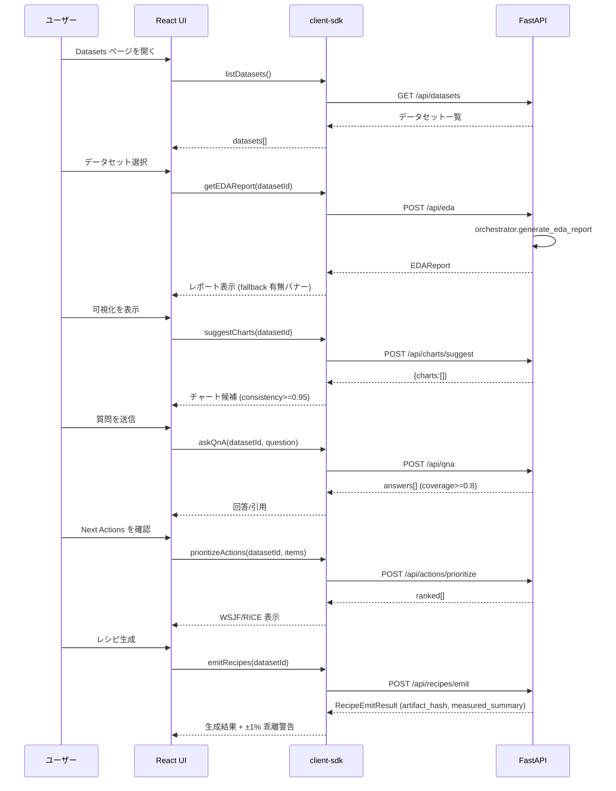
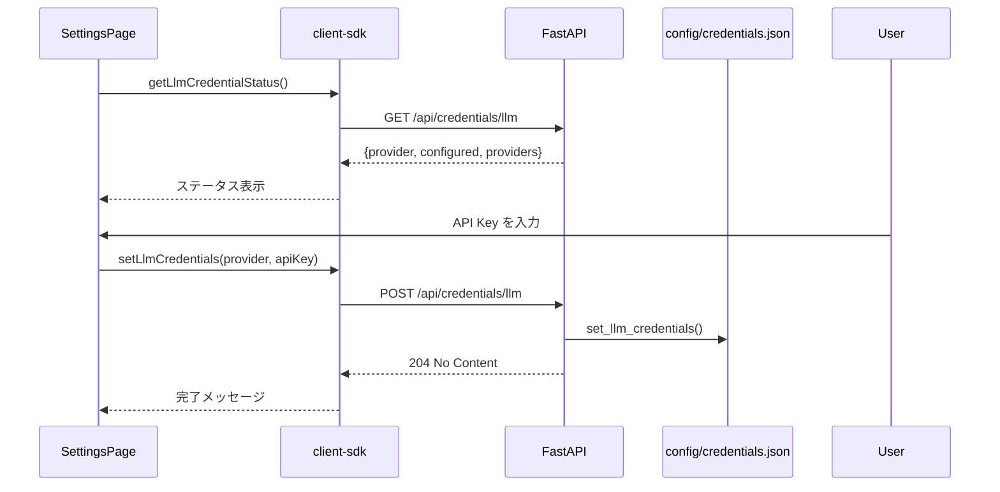
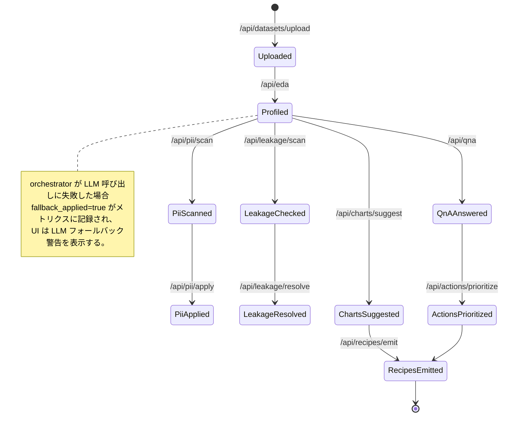

# AutoEDA 画面/状態図 (2025-09-18 時点)

`docs/requirements.md` のストーリー A1〜D1, C1/C2, S1 を、現行実装 (`apps/web/src/pages/*`) に合わせて図示する。React Router によるシングルページ構成で、サイドバー (`App.tsx`) から主要ページへ遷移する。

---

## 1. サイトマップ (Router)

```mermaid
graph LR
  Home[/Home (/)/]
  Datasets[/Datasets (/datasets)/]
  Settings[/Settings (/settings)/]
  EDA[/EDA Summary (/eda/:datasetId)/]
  Charts[/Charts (/charts/:datasetId)/]
  QnA[/Q&A (/qna/:datasetId)/]
  Actions[/Next Actions (/actions/:datasetId)/]
  PII[/PII (/pii/:datasetId)/]
  Leakage[/Leakage (/leakage/:datasetId)/]
  Recipes[/Recipes (/recipes/:datasetId)/]

  Home --> Datasets
  Datasets --> EDA
  EDA --> Charts
  EDA --> QnA
  EDA --> Actions
  EDA --> PII
  EDA --> Leakage
  EDA --> Recipes
  Charts --> Recipes
  Actions --> Recipes
  Settings -.-> API["/api/credentials/llm"]
```

---

## 2. メインフロー (A1→A2→B1/B2→D1)



---

## 3. 品質フロー (C1/C2)

```mermaid
graph TD
  PIIPage[PII ページ] -->|初期ロード| PiiScan[/POST /api/pii/scan/]
  PiiScan --> Detected{検出フィールドあり?}
  Detected -->|Yes| Toggle[チェックボックスで選択]
  Toggle --> Apply[/POST /api/pii/apply/]
  Apply --> Refresh[/再度 /api/pii/scan]
  Refresh --> PIIPage
  Detected -->|No| PIIPage

  LeakagePage[Leakage ページ] --> LeakScan[/POST /api/leakage/scan/]
  LeakScan --> Flags{flagged_columns}
  Flags -->|Yes| Select[チェックボックス]
  Select --> Action[exclude / acknowledge / reset]
  Action --> Resolve[/POST /api/leakage/resolve/]
  Resolve --> ReScan[/再度 /api/leakage/scan]
  ReScan --> LeakagePage
  Flags -->|No| LeakagePage
```

---

## 4. 設定フロー (S1: LLM 資格情報)



---

## 5. 画面別要素 (実装済みコンポーネント)

| 画面 | 主な表示要素 | API 呼び出し | 備考 |
| ---- | ------------ | ------------ | ---- |
| Home | 説明文のみ | なし | アップロード UI は未実装（バックログ） |
| Datasets | データセット一覧 (`Button` with variant="ghost") | `listDatasets()` | モックデータでフォールバック可能 |
| EDA | Summary/Distributions/QualityIssues/NextActions、引用ビュー切替 | `getEDAReport()` | `tool:` 参照でフォールバック警告 |
| Charts | チャート候補一覧、診断値表示 | `suggestCharts()` | consistency を百分率表示 |
| Q&A | 入力フォーム、回答、引用 | `askQnA()` | coverage を表示 |
| Actions | 優先度付きリスト、引用ビュー | `prioritizeActions()` + `getEDAReport()` | WSJF/RICE を小数点 2 桁で表示 |
| PII | チェックボックス、ポリシー選択、結果表示 | `piiScan()` / `applyPiiPolicy()` | `updated_at` を日付表示 |
| Leakage | フラグ一覧、除外/承認/リセットボタン | `leakageScan()` / `resolveLeakage()` | 選択が空の場合ボタン無効 |
| Recipes | 生成ファイル一覧、再現統計、引用ビュー | `emitRecipes()` + `getEDAReport()` | ±1% 乖離検出で警告バナー |
| Settings | プロバイダ状態、API Key 入力フォーム | `getLlmCredentialStatus()` / `setLlmCredentials()` | 保存後に再ロード |

---

## 6. データセット状態遷移



---

## 7. エラー / フォールバック表示

- **LLM フォールバック**: `references` に `tool:` で始まる参照が含まれる場合、EDA/Actions/Recipes ページで黄色の警告バナーを表示。
- **SLO 超過**: UI では即時表示しないが、`data/metrics/events.jsonl` に `duration_ms` が記録される。`python3 apps/api/scripts/check_slo.py` で検知。
- **PII/Leakage 未設定**: API が空配列を返した場合は「なし」と表示。
- **レシピ再現差分**: `measured_summary` の ±1% を超えた場合、赤い警告バナーを表示。

---

## 8. 補足 (バックログ)

- Home に CSV アップロードモーダルを追加し、`POST /api/datasets/upload` と連携する UI を今後実装する。
- Storybook 導入後、各ページを Container/Presentational に分割し、本ドキュメントを更新する予定。

現行実装に沿った図面を維持し、機能追加時は本ファイルを更新すること。
