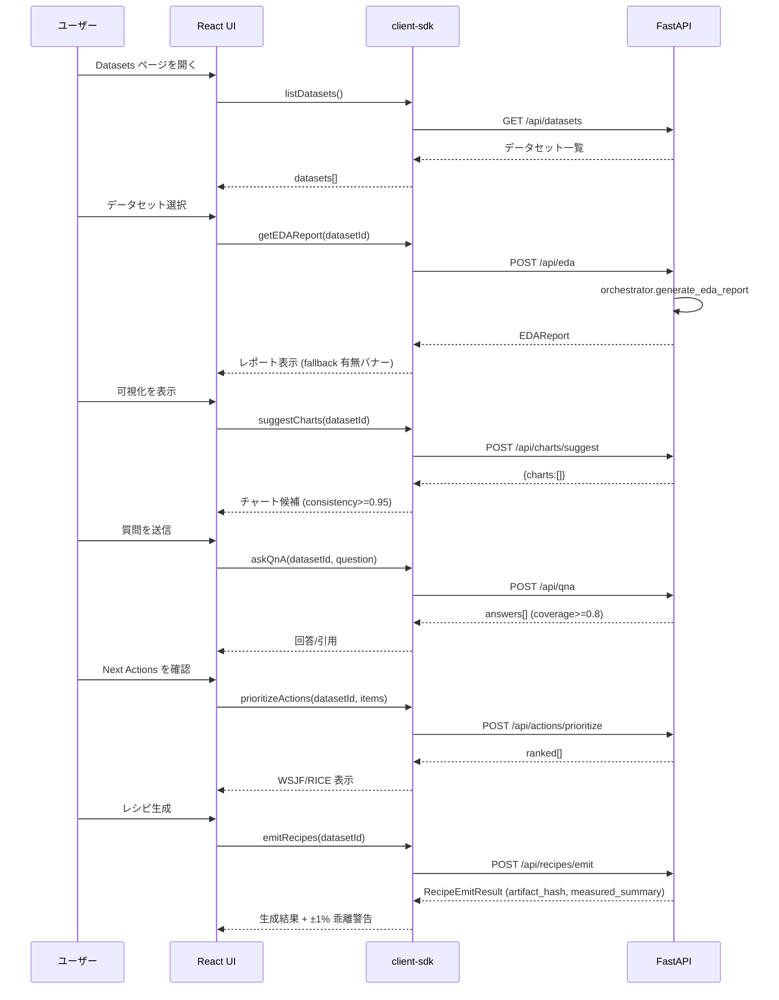
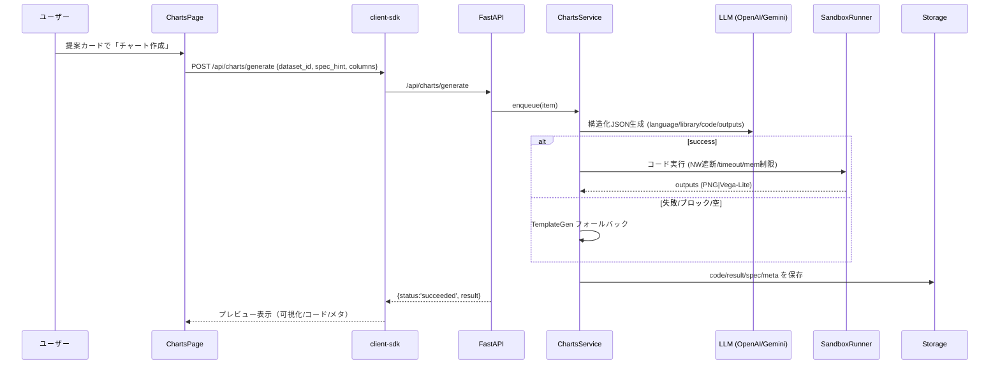
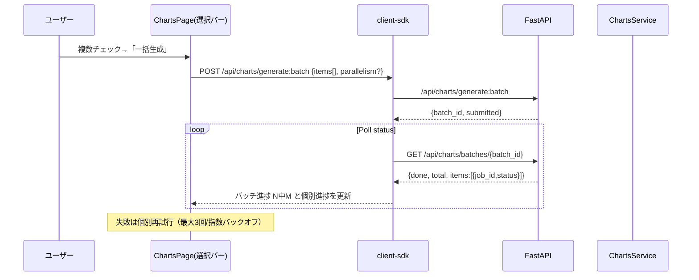
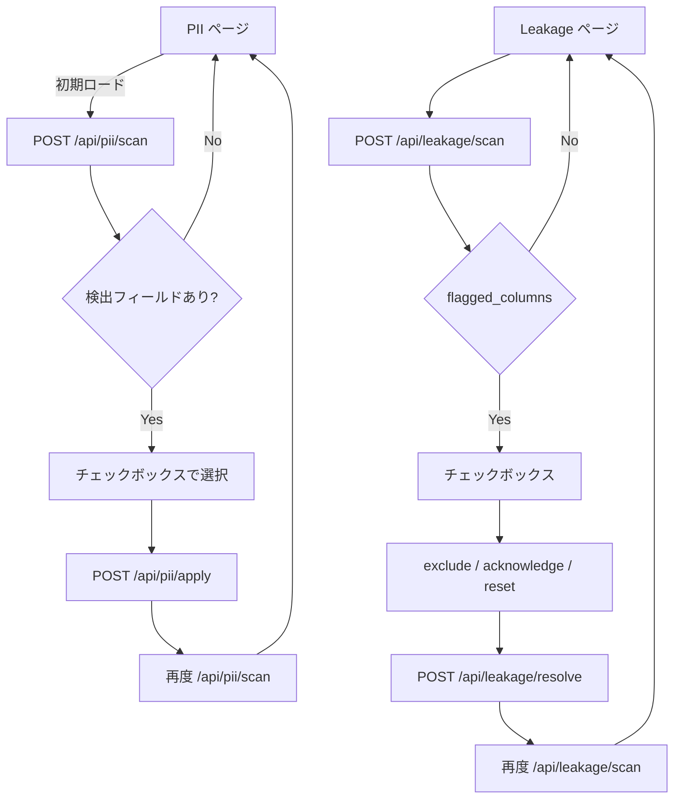
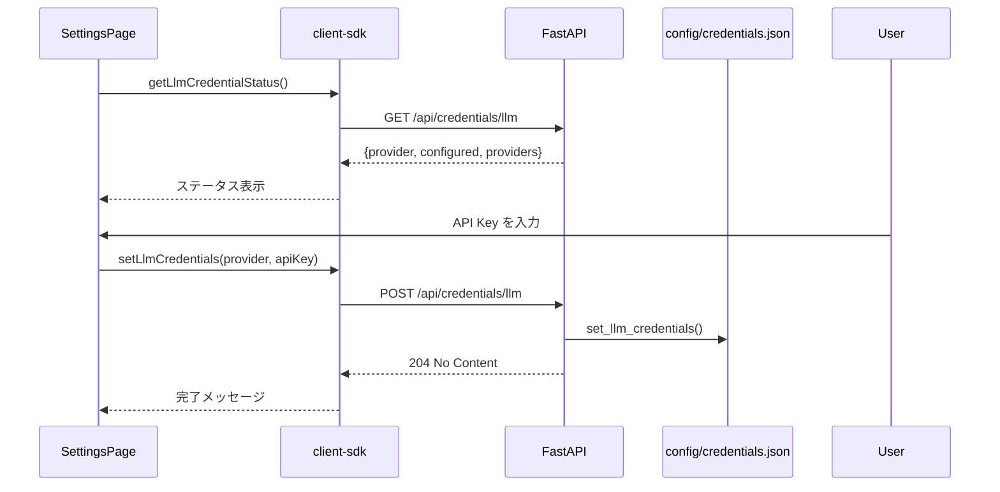
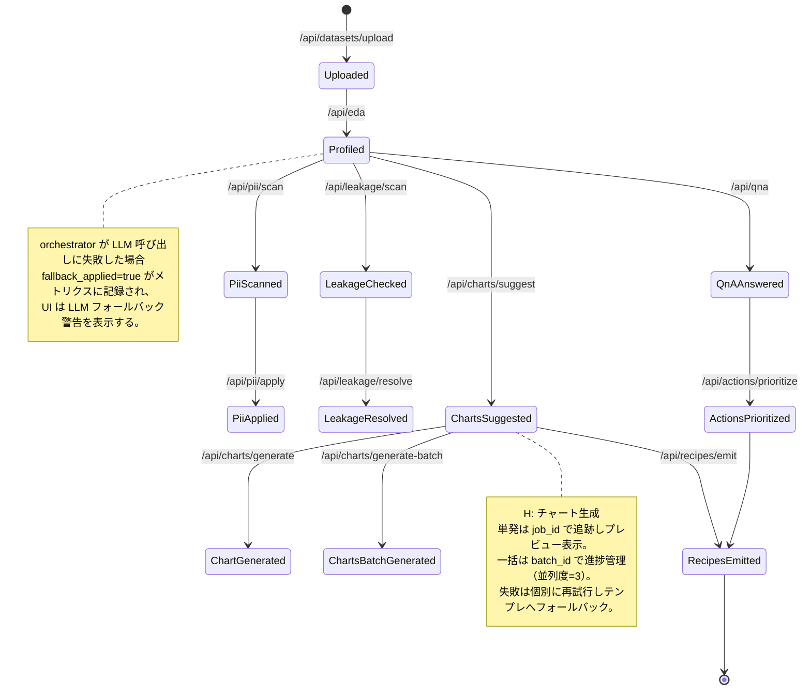

# AutoEDA 画面/状態図 (2025-09-19 時点)

`docs/requirements.md` と `docs/requirements_v2.md`（Capability H: CH-01〜CH-21）を反映し、現行実装 (`apps/web/src/pages/*`)＋設計 (`docs/design.md`) に基づく図を提供する。React Router によるシングルページ構成で、サイドバー (`App.tsx`) から主要ページへ遷移する。

---

## 1. サイトマップ (Router)

```mermaid
graph LR
  Home[Home /];
  Datasets[Datasets /datasets];
  Settings[Settings /settings];
  EDA[EDA Summary /eda/{id}];
  Charts[Charts /charts/{id}];
  ChartsBulk[Bulk select & generate];
  QnA[QnA /qna/{id}];
  Actions[Next Actions /actions/{id}];
  PII[PII /pii/{id}];
  Leakage[Leakage /leakage/{id}];
  Recipes[Recipes /recipes/{id}];

  Home --> Datasets;
  Datasets --> EDA;
  EDA --> Charts;
  EDA --> QnA;
  EDA --> Actions;
  EDA --> PII;
  EDA --> Leakage;
  EDA --> Recipes;
  Charts --> Recipes;
  Charts --> ChartsBulk;
  Actions --> Recipes;
  Settings -.-> API[API /api/credentials/llm];
```

---

## 2. メインフロー (A1→A2→B1/B2→D1) と新規 H（チャート生成）



---

### 2A. H（単発）チャート生成フロー（CH-01〜CH-08）



### 2B. H（一括）チャート生成フロー（CH-20/CH-21）



---

## 3. 品質フロー (C1/C2)



---

## 4. 設定フロー (S1: LLM 資格情報)



---

## 5. 画面別要素 (実装済み/計画中コンポーネント)

| 画面 | 主な表示要素 | API 呼び出し | 備考 |
| ---- | ------------ | ------------ | ---- |
| Home | 説明文のみ | なし | アップロード UI は未実装（バックログ） |
| Datasets | データセット一覧 (`Button` with variant="ghost") | `listDatasets()` | モックデータでフォールバック可能 |
| EDA | Summary/Distributions/QualityIssues/NextActions、引用ビュー切替 | `getEDAReport()` | `tool:` 参照でフォールバック警告 |
| Charts | チャート候補一覧、診断値表示、チェックボックス、一括生成バー | `suggestCharts()` / `generateChart()` / `generateChartsBatch()` | consistency を百分率表示。選択数バッジと進捗（N/M）表示 |
| Q&A | 入力フォーム、回答、引用 | `askQnA()` | coverage を表示 |
| Actions | 優先度付きリスト、引用ビュー | `prioritizeActions()` + `getEDAReport()` | WSJF/RICE を小数点 2 桁で表示 |
| PII | チェックボックス、ポリシー選択、結果表示 | `piiScan()` / `applyPiiPolicy()` | `updated_at` を日付表示 |
| Leakage | フラグ一覧、除外/承認/リセットボタン | `leakageScan()` / `resolveLeakage()` | 選択が空の場合ボタン無効 |
| Recipes | 生成ファイル一覧、再現統計、引用ビュー | `emitRecipes()` + `getEDAReport()` | ±1% 乖離検出で警告バナー |
| Settings | プロバイダ状態、API Key 入力フォーム | `getLlmCredentialStatus()` / `setLlmCredentials()` | 保存後に再ロード |

---

## 6. データセット状態遷移（H を含む）



---

## 7. エラー / フォールバック表示

- **LLM フォールバック**: `references` に `tool:` で始まる参照が含まれる場合、EDA/Actions/Recipes ページで黄色の警告バナーを表示。
- **SLO 超過**: UI では即時表示しないが、`data/metrics/events.jsonl` に `duration_ms` が記録される。`python3 apps/api/scripts/check_slo.py` で検知。
- **PII/Leakage 未設定**: API が空配列を返した場合は「なし」と表示。
- **レシピ再現差分**: `measured_summary` の ±1% を超えた場合、赤い警告バナーを表示。
- **チャート生成（H）**:
  - LLM 空応答/JSON不整合/安全フィルタ: カード内に人間可読エラー（カテゴリ含む）を表示し、テンプレート生成に切替可。
  - 一括生成: 失敗は個別扱い。他カードは継続。再試行は最大3回で指数バックオフ。

---

## 8. 補足 (バックログ)

- Home に CSV アップロードモーダルを追加し、`POST /api/datasets/upload` と連携する UI を今後実装する。
- Storybook/Playwright VR を活用し、Charts（H）の代表チャートで Linux ベースラインに対する差分検知を行う。

現行実装に沿った図面を維持し、機能追加時は本ファイルを更新すること。
