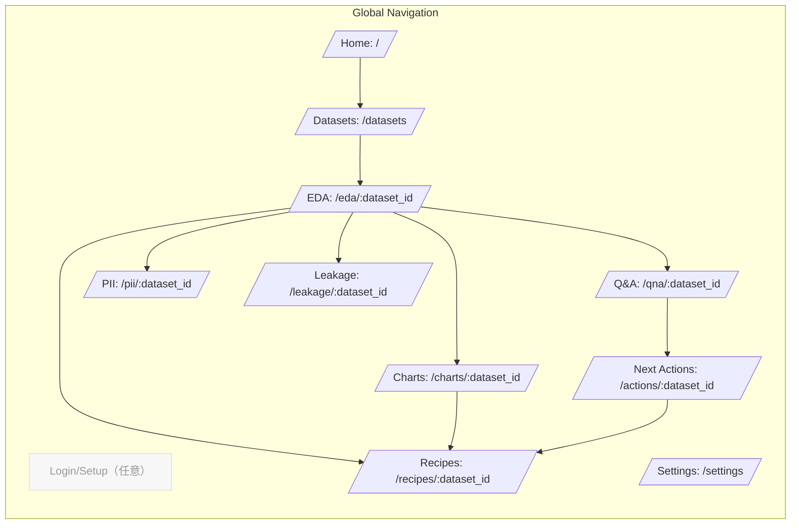
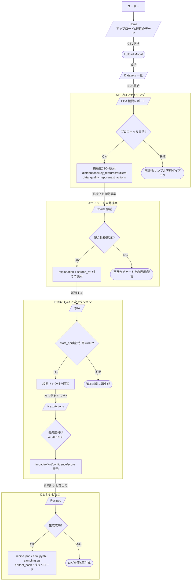
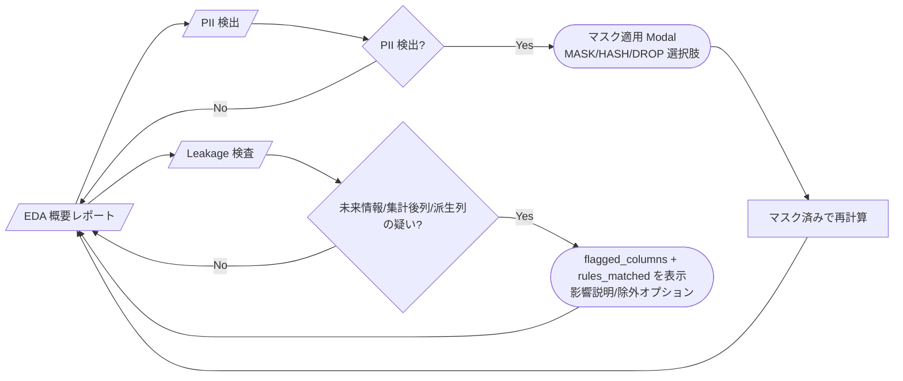
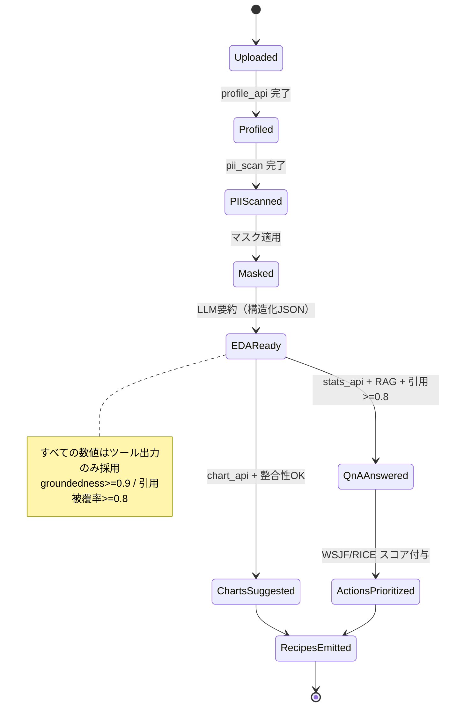
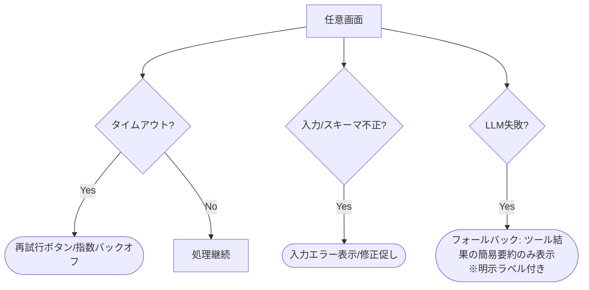

# AutoEDA（プロトタイピング版）画面遷移図

> `requirements.md` の設計方針に合わせ、**A1〜D1**の主要フローをページ（四角）／モーダル（丸角）／分岐（ひし形）で記載。
> ルーティングは \*\*/（Next.js 互換）\*\*の想定ですが、Vite でも同等に実装可能です。

---

## 1) サイトマップ（全体俯瞰）



---

## 2) メインフロー（A1→A2→B1/B2→D1）



---

## 3) 品質/セキュリティ補助フロー（C1/C2）



---

## 4) 画面別 UI 要素（主要コンポーネント／遷移）

| 画面(Route)                         | 主要UI/コンポーネント                                                                                     | 主要操作                                 | 遷移先                                                                   |
| --------------------------------- | ------------------------------------------------------------------------------------------------ | ------------------------------------ | --------------------------------------------------------------------- |
| **Home** (`/`)                    | DatasetUploader, RecentDatasets, KPI バッジ                                                         | CSV 選択 / アップロード                      | `/datasets/`                                                          |
| **Datasets** (`/datasets/`)       | DatasetTable（rows/cols/更新日時）, NewEDA ボタン                                                         | 「EDAを開始」                             | `/eda/:dataset_id/`                                                   |
| **EDA 概要** (`/eda/:id`)           | SummaryCards（distributions/key\_features/outliers）, QualityIssuesList（重大度/根拠）、NextActionsPreview | 「可視化を自動提案」「Q\&A」「PII/Leakage」「レシピ出力」 | `/charts/:id`, `/qna/:id`, `/pii/:id`, `/leakage/:id`, `/recipes/:id` |
| **Charts 候補** (`/charts/:id`)     | ChartGallery(最大5), ExplanationPanel, ConsistencyBadge                                            | 採用/除外、ソース参照                          | `/recipes/:id` or 戻る                                                  |
| **Q\&A** (`/qna/:id`)             | QuestionBox, AnswerPane（引用タブ・統計タブ）, Followups                                                    | 送信/再検索                               | `/actions/:id`                                                        |
| **Next Actions** (`/actions/:id`) | PrioritizedList（impact/effort/confidence/score）, フィルタ/並び替え                                       | 採択/エクスポート                            | `/recipes/:id`                                                        |
| **PII** (`/pii/:id`)              | DetectedFieldsTable, MaskPolicySelector                                                          | 適用/差戻し                               | `/eda/:id`                                                            |
| **Leakage** (`/leakage/:id`)      | FlaggedColumns, RulesMatched, 影響説明                                                               | 除外/承認                                | `/eda/:id`                                                            |
| **Recipes** (`/recipes/:id`)      | ArtifactsList（`recipe.json`/`eda.ipynb`/`sampling.sql`）, Hash/Version                            | ダウンロード                               | 終了                                                                    |

---

## 5) 画面状態（State Machine：データセット単位）



---

## 6) エラー/フォールバック遷移（共通）



---

## 7) ルーティング設計（Next.js 例）

```
app/
├─ page.tsx                      # Home
├─ datasets/page.tsx             # Datasets
├─ eda/[dataset_id]/page.tsx     # EDA 概要
├─ charts/[dataset_id]/page.tsx  # Charts 候補
├─ qna/[dataset_id]/page.tsx     # Q&A
├─ actions/[dataset_id]/page.tsx # Next Actions
├─ pii/[dataset_id]/page.tsx     # PII
├─ leakage/[dataset_id]/page.tsx # Leakage
└─ recipes/[dataset_id]/page.tsx # Recipes
```

---

## 8) 画面遷移チェックリスト（受け入れ要件トレース）

* A1: `/eda/:id` 到達時に **構造化JSON** の全セクションが表示される（根拠リンク付）。
* A2: `/charts/:id` で **不整合チャートは非表示**、説明に `source_ref` 必須。
* B1: `/qna/:id` の回答中、**数値はツール出力のみ**・**引用被覆率≥0.8**。
* B2: `/actions/:id` の各アクションに **impact/effort/confidence/score**。
* C1: `/pii/:id` で **検出→マスク→再計算** の往復が画面遷移で成立。
* C2: `/leakage/:id` で **flagged\_columns** と **rules\_matched** の確認→承認/除外。
* D1: `/recipes/:id` で **3成果物** のダウンロードが可能、**artifact\_hash** 表示。

---

### 備考（プロトタイプ向けUI実装ヒント）

* **非同期状態の可視化**：各ページに `LoadingBar` / `Toast` / `Retry` を標準実装。
* **根拠の開示**：Explanation セクションは常に **「数値タブ」「引用タブ」** を持つ。
* **スモールステップ**：A1 完了後に順次ボタンを活性化（A2/Q\&A/NextActions/Recipes）。
* **アクセシビリティ**：表は見出しセル＋行キー、キーボード操作（←→でタブ切替）。
