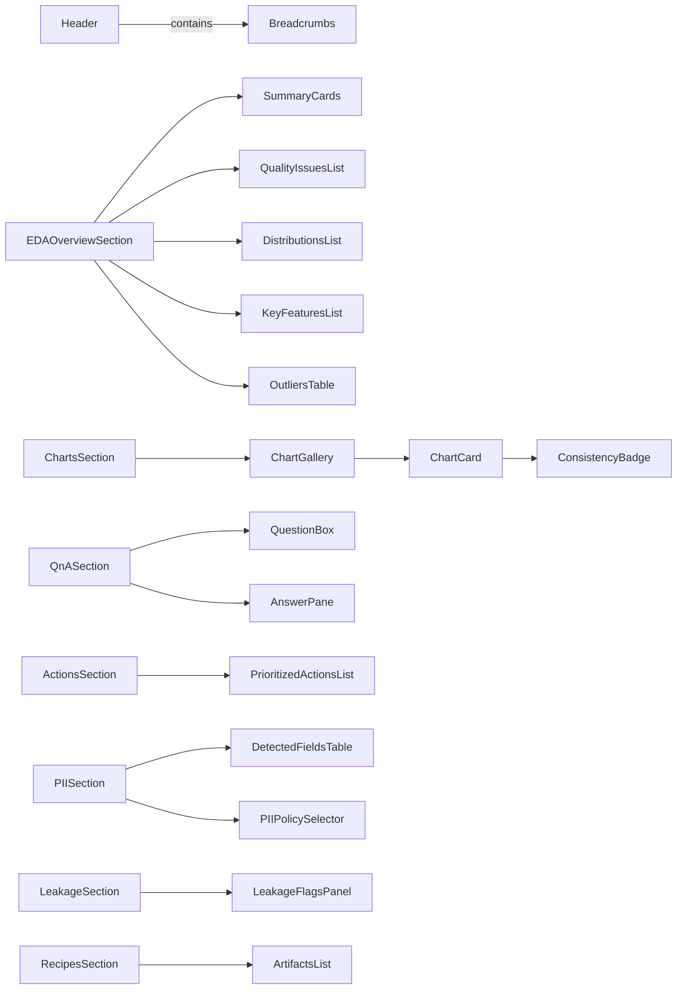

# AutoEDA Storybook コンポーネント分解図 v1

> 目的: HLD/ワイヤーフレームを Storybook で素早く検証するための **コンポーネント設計（Props/State/Events）** と **CSF3 ストーリー雛形**。Atomic Design（Atoms→Molecules→Organisms→Templates）で整理。全体で **ステートレス優先**、ページ固有の状態は Wrapper（Stories 側）で管理。

---

## 0. 共通型（`packages/schemas` 由来の最小抜粋）

```ts
export type Severity = 'low'|'medium'|'high'|'critical'

export interface DatasetSummary { id: string; name: string; rows: number; cols: number; updatedAt: string }
export interface QualityIssue { severity: Severity; column: string; description: string; statistic: Record<string, number | string>; evidenceId?: string }
export interface Distribution { column: string; dtype: string; count: number; missing: number; histogram: number[]; sourceRef?: Reference }
export interface OutlierInfo { column: string; indices: number[]; sourceRef?: Reference }
export interface Reference { kind: 'table'|'column'|'cell'|'figure'|'query'|'doc'; locator: string; evidence_id?: string }
export interface ChartCandidate { id: string; type: string; spec?: any; explanation: string; source_ref: Reference; consistency_score?: number }
export interface NextAction { title: string; reason?: string; impact: number; effort: number; confidence: number; score?: number; dependencies?: string[] }
```

> **原則**: UI コンポーネントは API 呼び出しを持たず、入出力は上記型の **Props/Events** で完結。

---

## 1. Atoms

### 1.1 `Button`

* **Props**
  \| prop | type | default | note |
  \|---|---|---|---|
  \| `variant` | 'primary' | 'primary' | 'secondary'|'ghost' など |
  \| `size` | 'sm'|'md'|'lg' | 'md' |  |
  \| `disabled` | boolean | false |  |
  \| `onClick` | () => void | — | **Event** |

### 1.2 `Badge`

* **Props**: `label: string`, `tone: 'info'|'success'|'warning'|'error'`

### 1.3 `ProgressBar`

* **Props**: `value: number (0..100)`, `indeterminate?: boolean`

### 1.4 `Toast`

* **Props**: `message: string`, `tone`, `onDismiss?: () => void`

---

## 2. Molecules

### 2.1 `Header`

* **Props**
  \| prop | type | note |
  \|---|---|---|
  \| `datasetName?` | string | 現在選択中データセット名 |
  \| `onOpenHelp?` | () => void | **Event** |
  \| `onOpenSettings?` | () => void | **Event** |

### 2.2 `UploadPanel`

* **Props**
  \| prop | type | default | note |
  \|---|---|---|---|
  \| `accept` | string | '.csv' |  |
  \| `maxCols` | number | 50 | 表示用 |
  \| `maxRows` | number | 1\_000\_000 | 表示用 |
  \| `samplingEnabled` | boolean | true |  |
  \| `onUpload` | (file: File, opts: { sample?: boolean }) => void | — | **Event** |

### 2.3 `DatasetTable`

* **Props**
  \| prop | type | note |
  \|---|---|---|
  \| `rows` | DatasetSummary\[] |  |
  \| `onOpen` | (id: string) => void | **Event** |
  \| `onStartEDA` | (id: string) => void | **Event** |

### 2.4 `SummaryCards`

* **Props**
  \| prop | type | note |
  \|---|---|---|
  \| `rows` | number | 行数 |
  \| `cols` | number | 列数 |
  \| `missingRate` | number | 欠損率（0..1） |
  \| `typeMix` | Record\<string, number> | dtype 構成 |

### 2.5 `QualityIssuesList`

* **Props**
  \| prop | type | note |
  \|---|---|---|
  \| `issues` | QualityIssue\[] | 重大度バッジ、列、説明、\[参照] |
  \| `onSelectIssue?` | (idx: number) => void | **Event** |

### 2.6 `DistributionsList`

* **Props**: `items: Distribution[]`, `onInspect? (col: string) => void`

### 2.7 `KeyFeaturesList`

* **Props**: `items: string[]`

### 2.8 `OutliersTable`

* **Props**: `rows: OutlierInfo[]`, `onView? (col: string) => void`

### 2.9 `ChartCard`

* **Props**
  \| prop | type | note |
  \|---|---|---|
  \| `chart` | ChartCandidate | explanation + source\_ref + score |
  \| `showConsistency` | boolean | バッジ表示 |
  \| `onAdopt` | (id: string) => void | **Event** |
  \| `onExclude` | (id: string) => void | **Event** |

### 2.10 `ChartGallery`

* **Props**: `charts: ChartCandidate[]`, `filterConsistent?: boolean`, `onAdopt`, `onExclude`

### 2.11 `ExplanationPanel`

* **Props**: `text: string`, `references: Reference[]`

### 2.12 `ConsistencyBadge`

* **Props**: `score?: number` （0..1）, `threshold?: number`（既定:0.95）

### 2.13 `QuestionBox`

* **Props**: `placeholder?: string`, `onAsk: (q: string) => void`, `loading?: boolean`

### 2.14 `AnswerPane`

* **Props**
  \| prop | type | note |
  \|---|---|---|
  \| `answer` | string | マークダウン可 |
  \| `numbers` | Record\<string, any> | stats\_api 出力 |
  \| `references` | Reference\[] | RAG 由来 |
  \| `coverage` | number | 引用被覆率（0..1） |

### 2.15 `PrioritizedActionsList`

* **Props**: `items: NextAction[]`, `onToggle?: (title: string, checked: boolean) => void`, `onExport?: () => void`

### 2.16 `PIIPolicySelector`

* **Props**: `detected: { column: string; type: string }[]`, `policy: 'MASK'|'HASH'|'DROP'`, `onApply: (policy: string) => void`

### 2.17 `DetectedFieldsTable`

* **Props**: `rows: { column: string; type: string }[]`

### 2.18 `LeakageFlagsPanel`

* **Props**: `flaggedColumns: string[]`, `rulesMatched: string[]`, `onExclude: (col: string) => void`

### 2.19 `ArtifactsList`

* **Props**: `files: { name: string; href: string }[]`, `hash: string`, `onRegenerate?: () => void`

---

## 3. Organisms（ページ断面のまとまり）

### 3.1 `EDAOverviewSection`

* **構成**: `SummaryCards` + `QualityIssuesList` + `DistributionsList` + `KeyFeaturesList` + `OutliersTable`
* **Props**
  \| prop | type |
  \|---|---|
  \| `summary` | { rows\:number; cols\:number; missingRate\:number; typeMix\:Record\<string,number> }
  \| `issues` | QualityIssue\[] |
  \| `distributions` | Distribution\[] |
  \| `keyFeatures` | string\[] |
  \| `outliers` | OutlierInfo\[] |
  \| `onNext` | (target: 'charts'|'qna'|'pii'|'leakage'|'recipes') => void |

### 3.2 `ChartsSection`

* **構成**: `ChartGallery` + `ExplanationPanel`
* **Props**: `charts: ChartCandidate[]`, `filterConsistent?: boolean`, `onAdopt`, `onExclude`, `onProceedRecipes`

### 3.3 `QnASection`

* **構成**: `QuestionBox` + `AnswerPane`
* **Props**: `onAsk`, `answer`, `numbers`, `references`, `coverage`

### 3.4 `ActionsSection`

* **構成**: `PrioritizedActionsList`
* **Props**: `items: NextAction[]`, `onExport`

### 3.5 `PIISection`

* **構成**: `DetectedFieldsTable` + `PIIPolicySelector`
* **Props**: `detected`, `policy`, `onApply`

### 3.6 `LeakageSection`

* **構成**: `LeakageFlagsPanel`
* **Props**: `flaggedColumns`, `rulesMatched`, `onExclude`

### 3.7 `RecipesSection`

* **構成**: `ArtifactsList`
* **Props**: `files`, `hash`, `onRegenerate`

---

## 4. Storybook セットアップ指針（CSF3）

### 4.1 例: `ChartCard.stories.tsx`

```tsx
import type { Meta, StoryObj } from '@storybook/react'
import { ChartCard } from './ChartCard'

const meta: Meta<typeof ChartCard> = {
  title: 'Molecules/ChartCard',
  component: ChartCard,
  args: {
    chart: {
      id: 'c1', type: 'bar', explanation: '売上の季節性を示す',
      source_ref: { kind: 'figure', locator: 'fig:sales_seasonality' },
      consistency_score: 0.97,
    },
    showConsistency: true,
  },
  argTypes: {
    onAdopt: { action: 'adopted' },
    onExclude: { action: 'excluded' },
    'chart.consistency_score': { control: { type: 'range', min: 0, max: 1, step: 0.01 } },
  },
}
export default meta

type Story = StoryObj<typeof ChartCard>

export const Default: Story = {}
export const LowConsistency: Story = {
  args: { chart: { id: 'c2', type: 'line', explanation: 'ノイズ多め', source_ref: {kind:'figure', locator:'fig:noise'}, consistency_score: 0.72 } }
}
```

### 4.2 例: `EDAOverviewSection.stories.tsx`（状態を Stories 側で保持）

```tsx
import type { Meta, StoryObj } from '@storybook/react'
import { EDAOverviewSection } from './EDAOverviewSection'
import { useState } from 'react'

const meta: Meta<typeof EDAOverviewSection> = {
  title: 'Organisms/EDAOverviewSection',
  component: EDAOverviewSection,
}
export default meta

type Story = StoryObj<typeof EDAOverviewSection>

export const Playground: Story = {
  render: () => {
    const [nav, setNav] = useState('')
    return (
      <EDAOverviewSection
        summary={{ rows: 1000000, cols: 48, missingRate: 0.12, typeMix: { int: 20, float: 10, cat: 18 } }}
        issues={[{ severity:'high', column:'price', description:'欠損が多い', statistic:{ missing: 0.32 } }]}
        distributions={[{ column:'price', dtype:'float', count:100, missing:5, histogram:[1,2,3] }]}
        keyFeatures={["price×promotion が強い関係"]}
        outliers={[{ column:'sales', indices:[12,45] }]}
        onNext={(t) => setNav(t)}
      />
    )
  }
}
```

### 4.3 例: `AnswerPane.stories.tsx`（タブ/引用率コントロール）

```tsx
import type { Meta, StoryObj } from '@storybook/react'
import { AnswerPane } from './AnswerPane'

const meta: Meta<typeof AnswerPane> = {
  title: 'Molecules/AnswerPane',
  component: AnswerPane,
  args: {
    answer: '上位要因は **promotion_rate** と **holiday_flag** です。',
    numbers: { corr: { promotion_rate: 0.42, holiday_flag: 0.31 } },
    references: [ { kind:'query', locator:'q:corr_top5' } ],
    coverage: 0.86,
  },
  argTypes: {
    coverage: { control: { type: 'range', min: 0, max: 1, step: 0.01 } }
  }
}
export default meta

type Story = StoryObj<typeof AnswerPane>
export const Default: Story = {}
```

---

## 5. Controls/Events 一覧（Storybook 側）

| コンポーネント                | Controls 例                              | Actions 例              |
| ---------------------- | --------------------------------------- | ---------------------- |
| UploadPanel            | `samplingEnabled`, `maxRows`, `maxCols` | `onUpload`             |
| DatasetTable           | —                                       | `onOpen`, `onStartEDA` |
| QualityIssuesList      | —                                       | `onSelectIssue`        |
| ChartGallery           | `filterConsistent`                      | `onAdopt`, `onExclude` |
| QuestionBox            | `placeholder`, `loading`                | `onAsk`                |
| AnswerPane             | `coverage`                              | —                      |
| PrioritizedActionsList | —                                       | `onToggle`, `onExport` |
| PIIPolicySelector      | `policy`                                | `onApply`              |
| LeakageFlagsPanel      | —                                       | `onExclude`            |
| ArtifactsList          | —                                       | `onRegenerate`         |

---

## 6. アクセシビリティ指針（抜粋）

* **表**: `th`/`scope`、行見出し、キーボード操作（↑↓→←）。
* **カード**: `aria-labelledby`/`aria-describedby` を Explanation/Reference に紐付け。
* **トグル**: Adopt/Exclude はトグルボタン+ラベル明示。
* **色だけに依存しない**: ConsistencyBadge はスコア値とアイコンを併記。

---

## 7. 親子関係図（抜粋 / Mermaid）



---

## 8. Mock データ（`packages/schemas/mocks.ts`）

```ts
export const ds1: DatasetSummary = { id:'ds_001', name:'sales.csv', rows: 1_000_000, cols: 48, updatedAt:'2025-09-12' }
export const issues: QualityIssue[] = [ { severity:'high', column:'price', description:'欠損多', statistic:{ missing:0.32 }, evidenceId:'cell:price:missing' } ]
export const charts: ChartCandidate[] = [
  { id:'c1', type:'bar', explanation:'季節性', source_ref:{kind:'figure', locator:'fig:sales_seasonality'}, consistency_score:0.97 },
  { id:'c2', type:'line', explanation:'ノイズ高め', source_ref:{kind:'figure', locator:'fig:trend'}, consistency_score:0.72 },
]
export const actions: NextAction[] = [
  { title:'天候APIの追加', impact:0.7, effort:0.3, confidence:0.8, score:0.62 },
  { title:'カテゴリ統合', impact:0.5, effort:0.2, confidence:0.9, score:0.59 },
]
```

---

## 9. Storybook 運用 Tips

* **args を SSOT 化**: 代表モックは `packages/schemas/mocks.ts` に集約。
* **複合 Organisms は `render` でラップ**: ページ状態は Stories 側で `useState` 管理。
* **テスト**: `play` 関数で `userEvent` を使い Adopt/Exclude/Ask の対話を検証。
* **ビジュアル回帰**: Chromatic 等のスナップショットで差分検知。

---

## 10. ToDo（拡張）

* `ConsistencyBadge` のしきい値と色のマッピングを Design Token 化。
* `AnswerPane` に Markdown レンダラ（`@storybook/addon-interactions` 併用）。
* `ChartCard` に Vega-Lite spec の live preview（Mock renderer）。
